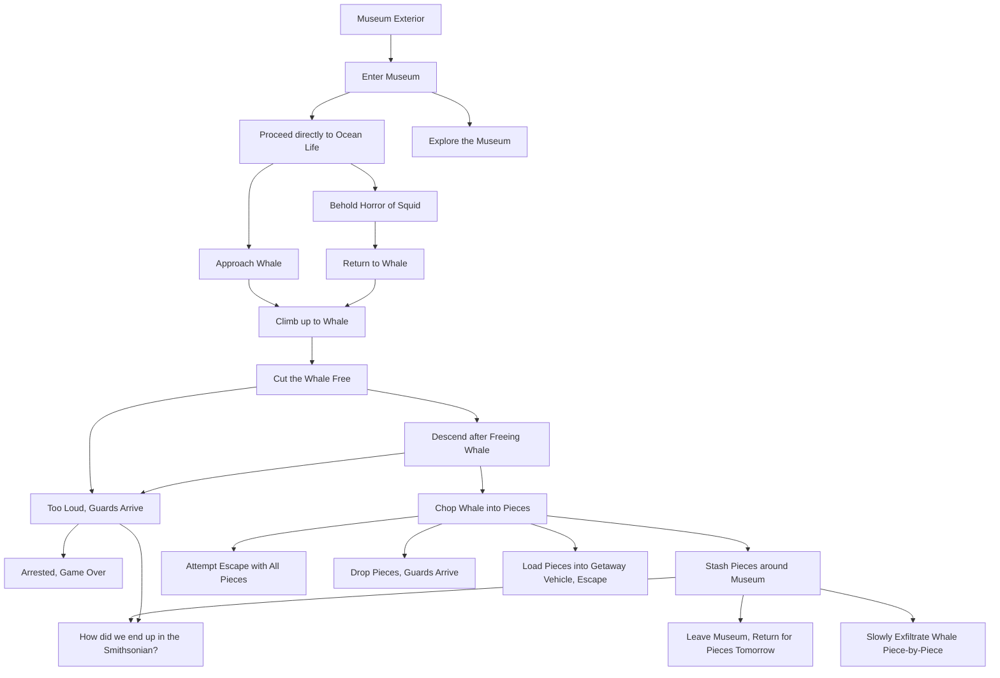

# whale-story
The game is Operation: Free Willy. The objective? To steal the blue whale from the NYC Museum of Natural History, under cover of night, piece by piece. It hangs in the Hall of Ocean Life, suspended 94 feet in the air. 

Composition? Fiberglass. 

Weight? 21,000lbs. 

Spirit? Unbreakable.

The Whale represents the unattainable — the sublime — awe, trepidation, wonder, and the supernatural. To rescue it from its dark imprisonment in the Hall, you must embark on a risky endeavor — one that could perturb the very fabric of reality itself. As long as the museum holds the whale, the sublime remains out of reach for those who do not pay what they wish. The heist is a high-stakes, solo endeavor; if any part of the plan goes awry, you risk life in prison for conspiracy to steal a national treasure. The museum does not want to let the whale go. 

## Gameplay & Mechanics

The game uses a scripted keyword-based progression, with several possible choices and outcomes at various stages of gameplay. Below is a high-level overview of the story logic, but it should be noted that not every one of the story elements has an associated set of keywords. There are several endpoints to the story, most of which conclude in the arrest of the perpetrator. 

At several points in the game, there are probablistic branches of the story that either allow for continuation, or randomly conclude the game according to a predefined distribution of outcomes. The random game elements where this occurs are associated with hypothetical outcomes where the perpetrator makes too much noise or performs an operation on the whale or museum incorrectly, alerting the guards and law enforcement to their presence. These forked sections of the gameplay are placeholders for extensions to the storyline, where longer branched progressions have not yet been defined or implemented.

## Game Progression

Below is a mermaid chart outlining the rough progression of the game’s storyline and associated logic. 

The game begins at the exterior of the museum, directly outside the Theodore Roosevelt entrance. Despite the storyline inconsistencies raised by this decision, the exterior outside of this entrance was designated the starting point for any distinct progression through the game that results in arrest or death. Under all circumstances, when the player is arrested, killed, or taken to Washington, DC, they return to the exterior of the museum on 81st Street, outside the Theodore Roosevelt entrance hall.

## Design and Methodology
I will preface this section by saying that I am not a programmer. I had a sour experience trying to learn C++ from a college textbook in 4th grade, and swore off coding for life because of it. This was a mistake. It took LLMs, and my computer being able to speak english, for me to produce any kind of code on my own that I was happy with. Functional code, not HTML. That, I can kind of do. I can do other things as well. But logic is what comes naturally, and writing — not programming. I don’t do well without some kind of reference to check back on. Hence this game, which began as a half-cocked chain-of-thought pipeline testing prompt. As it turns out, hypothetical heists — particularly in well-documented locations like the Natural History Museum — provide an excellent backdrop through which LLMs can reason (or not). The space is referenced often across the internet, the whale is described thoroughly across the webs, and it is a notable place that people hold dear to their hearts. 

I specifically like it as a test of spatial reasoning ability and logic. It’s also a good benchmark for monte carlo tree search CoT pipelines; the number of possible approaches and methodologies that models can choose at any point or place in the plot is quite large. It would not be surprising to see weaker models get a bit lost. The interesting thing, is that most don’t.

None of this is very pertinent to the game mechanics. But it is how this idea came about. 

An older, AI-generated version of the game can be found at https://theo-net.com/heist.html. The version in this repository is both functionally and stylistically inferior. But the story carries significant enhancements in depth and charisma. I would invite those reading this to view them as supplementary counterparts, representative of my personal deficiencies in programming and Artificial Intelligence’s deficiencies in creartive writing and complex logic.

## Intended Changes and Improvements
Presently, the game only has one outcome that qualifies as a victory. There are a couple of ways to reach this outcome, but they are the same outcome. In the future, I intend to branch out some of the various plotlines where the player is arrested or otherwise taken into custody, such that there are more paths through the storyline with alternative objectives for less oceanically-minded players. The dinosaur and advanced mammal halls will each have their own respective detours/storylines, with different objectives; should the player choose to heist another object from the museum aside from the whale.
